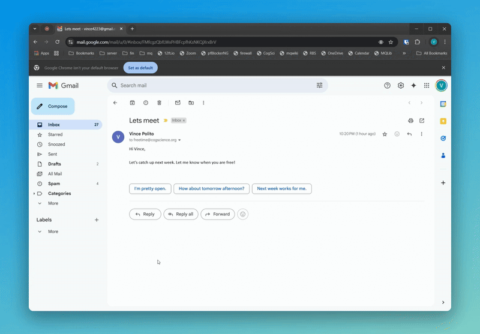

# FreeTime

<p align="center" width="100%">
    
</p>

**FreeTime is a lightweight system tray application that helps you quickly find and share your available meeting times. It checks your calendars and generates a list of free time slots that can be instantly pasted anywhere when you type a trigger phrase.**


## Demo
Anytime that you need to enter your calendar availability, just type the trigger phrase (default is "tt"). This phrase will be instantly replaced with a neat block of text showing all of your free calendar slots. 
This works in any window. 
See below:



## Features

- 🔍 Monitors multiple calendars simultaneously
- ⚡ Instantly paste your available times in any window with a customizable trigger phrase
- 🕒 Configurable working hours and date range
- 🔄 Automatic calendar updates
- 🌐 Works with any calendar that provides iCal/ICS feeds
- 💻 Runs in system tray
- 🚀 Single executable file, no installation needed

## Download

[Download](https://github.com/vince-p/freetime/releases) the latest version for your platform:
- Windows
- macOS

## Quick Start

1. Download and run FreeTime
2. Add your calendar URLs (see below for how to get these)
3. Set your preferred working hours and options
6. Use the trigger phrase anywhere (default ":tt") to paste your available times

**[Set app permissions on macOS](macsetup.md)**

## Setting Up Calendar URLs

### Google Calendar

1. Open [Google Calendar](https://calendar.google.com/calendar)
2. Click the three dots next to your calendar name
3. Select 'Settings and sharing'
4. Near the top of the page, ensure that "Make available to public" is checked. Select "See only free/busy (hide details)"
4. Scroll to 'Integrate calendar'
5. Copy the 'Public address in iCal format'


   
**Note:** This URL is not shared anywehre but anyone with this URL can view the times you are free/busy. There is no security risk using this in FreeTime. The calendar information never leaves your device.


### Microsoft Office 365

1. Open [Outlook Calendar](https://outlook.office.com/calendar)
2. Click the gear icon (Settings)
3. Select 'Shared Calendar'
4. Go the 'Publish a calendar' section (bottom part of window)
5. Select a calendar from the drop down list
6. Choose "Can view when I am busy" under "Permissions"
7. Click "Publish"
8. Copy the ICS link


## FreeTime Configuration Options

### Calendar Settings
- **Add or Remove URLs:** Enter ical urls for any calendars you want to conitor
- **Custom Text:** Modify the introductory text when pasting

### Time Settings
- **Meeting Hours:** Set your standard working hours
- **Lookahead Days:** Number of days to check for availability
- **Include Current Day:** Include today in available times
- **Exclude Weekends:** Remove weekends from available times
- **Ignore all-day and multi-day events** Should all day event be blocked out?
- **Timezone:** Set your local timezone

### App Settings
- **Update Interval:** How often to refresh calendar data (default 4 mins)
- **Trigger:** Customize the trigger phrase
- **Run at startup:** Launch automatically with system


## Feedback
This is my first app and I'd love any feedback if this is useful or if you find any bugs.
Contact me at freetime@cogscience.org

## Building from Source

1. Clone the repository
```bash
git clone https://github.com/vince-p/freetime.git
cd freetime
