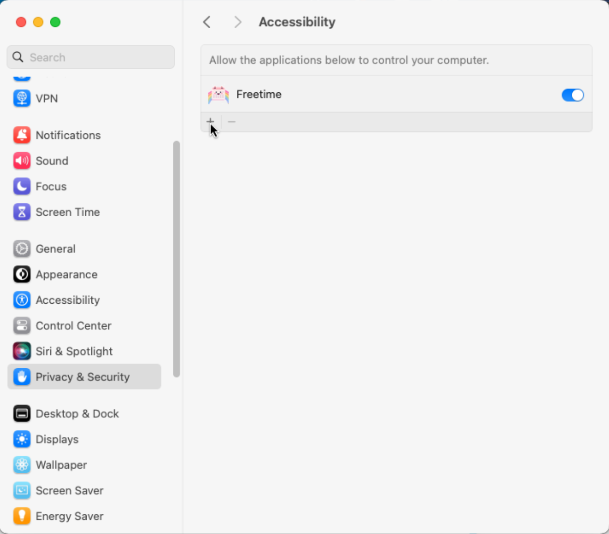
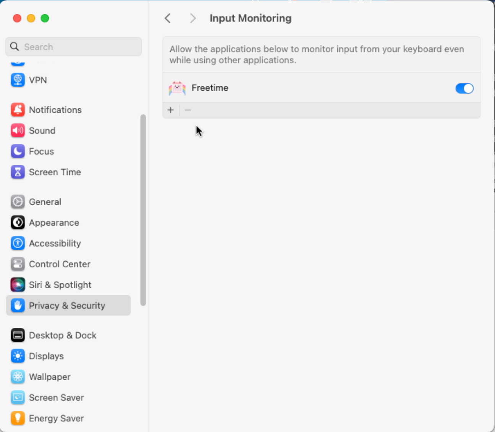

# Configuring Freetime on macOS

A few extra steps are needed to get the app working on macOS.
These only need to be done once.

1. Unzip the app file

2. Move the app to your desired location (Applications)

2. In Settings,  Add Privacy & Security -> Accessibility permission

3. In Settings, Add Privacy & Security -> Input Monitoring Permission

After this the app should run without issue.
